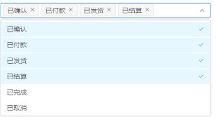
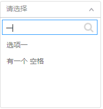

## 表单设计

> 业务 主要分为 列表和表单（新建，查看，编辑），二者从业务层面考虑有不同的责任 。

#### 开发从表单业务开始

表单是构成大的业务系统的业务单元，但要做好表单开发并不如想象中容易, 特别是刚参加工作的同学, 对业务通常不够重视, 造成在开发过程中未能专注业务逻辑本身，大量时间花在低价值的范错成本。Java 编程开身就是为业务开发而生，所以如果对业务开发不感兴趣，请转向调研时间比重较高的的底层技术开发

#### 列表业务

> 列表着重展示关键业务数据（用户不关心的关联 id 字段无需显示），重要操作直接在列表中提供（如 与状态转移相关）

> 务即实体的列表查询，实体项的 编辑/删除 操作（以及其他自定义的 操作） 实体新建等。 实休列表与实体新建与编辑有不同的业务表达。

##### 实体列表与实体编辑的区别

- 列表着重关注 关键信息 其他联表信息（如关联表其他字段信息，如用户的部门名称）， 统计信息(如部门的总人数)
- 列表首重实体项操作, 如查看，编辑，删除， 业务操作如状态转移
- 列表首重实体项批量操作,如批量删除，批量提交

#### 表单业务

> 着重展示除列表信息外其他的详细信息，重要的字段变更不能出现在编辑表单中，如状态转换, 财务数据变更等。

> 中的新建表单与编辑表单大部分内容相同，但又有很多值得要考虑的地方，如创建时间新建表单是没有的，但编辑表单是可见而不可编辑的。

#### 实体列表与实体编辑的区别

- 表单着重展示除列表信息外其他的详细信息，重要的字段变更不能出现在编辑表单中，如状态转换, 财务数据变更等。
- 表单负责子项实体列表的显示以及对子项的 CRUD 操作
- 表单负责除实体本身的字段信息外的 其他关联实体信息 审批信息 活动信息 统计信息等

## 数据库表设计

表单开发先从设计实体数据库表的细节中认真思考, 最低限度地减少复工成本。

#### 首先，对实体表，需从业务的角度，逐一考虑是否需要以下字段

| **Field Name** | **Description**                                                         | 是否需要 |
| -------------- | ----------------------------------------------------------------------- | -------- |
| id             | **固定必要字段**                                                        |          |
| name           | **实体固定必要字段** 考虑如果是实体， 即是必要的                        |          |
| status         | **实体状态必要字段**, 是否需要有状态转移                                |          |
| org_id         | **主表固定必要字段** 租户组织 id, 用于 SaaS 资源隔离                    |          |
| org_tag        | **主表固定必要字段** 租户组织 tag, 用于 SaaS 资源隔离                   |          |
| code           | **实体编号必要字段** (唯一字段)，常用于编号管理，如部门,会议室等        |          |
| category_id    | **分类固定必要字段** 所属分类，考虑实体是否需要分类管理                 |          |
| pid            | **多层级固定必要字段** 实体本身所属父类， 考虑是否是多层级实体(如部门） |          |
| version        | 版本控制 myBatis 保留字段, 用于保证多用户同时对实体修改                 |          |
| create_time    | 实体创建时间，需考虑实体是否需要记录创建时间                            |          |
| update_time    | 实体更新时间，需考虑实体是否需要记录更新时间                            |          |
| sort_num       | 排序字段，考虑实体是否需要自定义排序                                    |          |
| invalid        | 无效字段，实体是否需要有效控制(可由 status 控制)                        |          |

##### 对实体每一个字段，需要考虑**是否必填**（如果必填，字段定义为 not null）, 是否唯一（唯一字段为 unique)，是否组合键唯一，是否有默认值。

#### 数据库设计思考清楚并进行过 review，并后确定 approved 之后，可以通过工具生成代码。

> 5 分钟内即可完成 CRUD 代码的编写，说明即便一个简单的表单业务，写代码占用的时间比重是很小的。生成完代码，又重新回到表单的业务分析上面。

#### [数据库设计规范](#数据设计规范说明)

> 这些规范是对开发过程中因数据库设计导致的 API 开发问题进行总结，定义数据设计规范，以避免同类问题再次出现。
>
> Version:1.0

##### 关于数据库 sql 文件管理

> 各个模块各自管理模块相关的数据库文件, 无关模块的数据表 sql 文件以及基础模块的数据库.sql 无需作为代码提交

> > 不能直接从数据库中导出 sql 文件作为模块代码中的 resource/sql/app-schema.sql 提交

##### 数据表名命名规范

- 系统表名以 t\_ 作为前缀
- 项目或子系统表名以项目或子系统缩写作为前缀 如 cms*, vms*, crm*, vip*
- 表名前缀 不能超过 3 个英文字符（不包括 下划线）

##### 数据库关键字段定义标准

| **Field Name**     | **Type**                  | **Description**                                                                                                                                                                                                          |     |
| ------------------ | ------------------------- | ------------------------------------------------------------------------------------------------------------------------------------------------------------------------------------------------------------------------ | --- |
| id                 | bigint(20)                | 实体 id, bigint(20)                                                                                                                                                                                                      |     |
| pid                | bigint(20)                | 父节点 ID，不用 parent_id                                                                                                                                                                                                |     |
| org_id             | bigint(20)                | 用于隔离的组织 id, 由 crud-plus 维护                                                                                                                                                                                     |     |
| org_tag            | varchar(100)              | 用于隔离的组织标识, 参考 docker 而定                                                                                                                                                                                     |     |
| category_id        | bigint                    | 所属分类 ID                                                                                                                                                                                                              |     |
| name               | varchar                   | 表示实体名称及同一数据表内的其他相关字段                                                                                                                                                                                 |     |
| code               | varchar                   | 主表实体编号，除名字外标记实体唯一属性，设备 id 用 sn                                                                                                                                                                    |     |
| {entity}\_no       | varchar                   | 关联表的实体编号，如 vip_no                                                                                                                                                                                              |     |
| {entity}\_number   | varchar                   | 流水编号，由 实体名+Number 组成， 如 order_number                                                                                                                                                                        |     |
| sn                 | varchar                   | 设备编码，用于硬件设备序列号                                                                                                                                                                                             |     |
| status             | not null <br> varchar(26) | 实体状态，不能用 state, 其他状态用 stat                                                                                                                                                                                  |     |
| sort_num           | int                       | 实体排序号（不能用 sort,为数据库保留字段）,meta 字段开发保留字段<br> /api/meta/patch/entity/{entity}/action/moveup/row/{id}/row/{nextId} <br> /api/meta/patch/entity/{entity}/action/movedown/row/{id}/row/{nextId}      |     |
| enabled            | smallint                  | 启用/禁用，不用 enable                                                                                                                                                                                                   |     |
| invalid            | smallint                  | 是否失效, 默认为 0/有效                                                                                                                                                                                                  |     |
| is_deleted         | smallint                  | 逻辑删除 默认值 0, 1 为删除标记                                                                                                                                                                                          |     |
| version            | int                       | 版本号，myBatis 保留字段，用于多用户同时更新锁定                                                                                                                                                                         |     |
| **时间相关**       |                           |                                                                                                                                                                                                                          |     |
| create_time        | datetime                  | 实体创建时间,crud-plus 框架保留字段**,**自动忽略更新                                                                                                                                                                     |     |
| last_modified_time | timestamp                 | 用于对实体信息作了修改的时间，通常用于跟踪实体的修改时间，对修改频率比较高的实体必须具备有此字段。<br> crud-plus 框架保留字段，且自动刷新修改时间 `last_modified_time` datetime DEFAULT NULL ON UPDATE CURRENT_TIMESTAMP |     |
| update_time        | datetime                  | 一般用于内容的更新，如文章内容,实体备注等。<br> crud-plus 框架保留字段，且自动刷新修改时间 <br> `updated_time` datetime DEFAULT NULL ON UPDATE CURRENT_TIMESTAMP                                                         |     |
| register_time      | datetime                  | 注册时间，通常用于除 created_time 之外的注册事件进行记录。                                                                                                                                                               |     |
| closed_time        | datetime                  | 用于状态的关闭时间                                                                                                                                                                                                       |     |
| expired_time       | datetime                  | 事件过期时间，不能用 expire_time, end_time                                                                                                                                                                               |     |
| start_time         | datetime                  | 事件开始时间，通常用于查询。不能用 begin_time                                                                                                                                                                            |     |
| end_time           | datetime                  | 用于时间段结束时间, 通常用于查询                                                                                                                                                                                         |     |
| **人力资源相关**   |                           |                                                                                                                                                                                                                          |     |
| gender             | smallint                  | 0 –男， 1-女，空值-保密， 2-保密                                                                                                                                                                                         |     |
| dob                | datetime                  | 生日, 不用 birthday                                                                                                                                                                                                      |     |
| author             | varchar                   | 作者, 通常是指文章（用于记录，不作外键关链），                                                                                                                                                                           |     |
| scheduler          | varchar                   | 制表人（用于记录，不作外键关链）                                                                                                                                                                                         |     |
| applicant          | varchar                   | 申请人-通常用于流程                                                                                                                                                                                                      |     |
| created_by         | varchar                   | 创建人                                                                                                                                                                                                                   |     |
| followed_by        | varchar                   | 跟进人                                                                                                                                                                                                                   |     |
| processed_by       | varchar                   | 受理人                                                                                                                                                                                                                   |     |
| approved_by        | varchar                   | 审批人-通常指流程                                                                                                                                                                                                        |     |
| charged_by         | varchar                   | 收费单位                                                                                                                                                                                                                 |     |
| **销售相关**       |                           |                                                                                                                                                                                                                          |     |
| transaction        | varchar                   | 流水号，用于处理订单号等，与时间序列有关                                                                                                                                                                                 |     |
| discount           | int                       | 折扣 用整型表示                                                                                                                                                                                                          |     |
| price              | decimal                   | 价格                                                                                                                                                                                                                     |     |

##### 数据设计规范说明

| 规范类型   | 规范说明                                                                                                                                            |
| ---------- | --------------------------------------------------------------------------------------------------------------------------------------------------- |
| 字段唯一性 | 充分考虑唯一字段的 unique 属性，从数据级别保证数据唯一性                                                                                            |
| 字段类型   | 不使用 bool 类型，用 smartint 代替， 不用使 text 类型，占用太大的空间，导致效率低，用固定宽度 varchar(512)                                          |
| 字段命名   | 数据字段命令统一用小写，下划线，即使专用名词也采用小写，如生日 DOB,用小写 dob                                                                       |
| 空字段     | 对于可为空的字段，在不影响业务的情况下，对可为空的字段设置必要的默认值，<br> 尽量使用 default，如 default=0 代替 default null。                     |
| 数据库设计 | 数据类型 <br> 1.不允许使用 double 数据类型，需要小数的情况使用 decimal 类型；<br> 2.bool 类型使用 smallint <br> 3.时间相关字段固定数据类型 datetime |
| 数据库设计 | 对于新建时间(或其他在插入时需要使用当前时间的时间类型字段) <br> 考虑使用 timestamp not null default current_timestamp                               |
| 数据库设计 | 表与表之间的关系使用数据表外键关联，不在业务层控制表与表之间的关系。                                                                                |
| 数据库设计 | 对用户跨服务或跨平台的访问不能以表自增 ID 作为唯一标识。即跨服务或跨平台时，<br> 表的设计就不应以 user_id 作为用户的唯一标识                        |

##### 修改表结构参考

> 添加一个字段

```
ALTER TABLE table_name ADD `field_name` varchar(26) DEFAULT null COMMENT '描述';
```

> 修改字段名称

```
ALTER TABLE table_name CHANGE COLUMN origin_name  `new_name` VARCHAR(20) DEFAULT NULL COMMENT;
```

> 修改字段类型

```
ALTER TABLE table_name MODIFY `modify_column` VARCHAR(10);
```

> 删除一个字段

```
ALTER TABLE table_name DROP COLUMN `column_name`;
```

> 新建唯一索引

```
ALTER TABLE table_name ADD UNIQUE KEY (`unique_column`);
```

> 修改唯一为组合键唯一 (首先删除该唯一再插入)

```
 SHOW create table table_name;

 ALTER TABLE table_name DROP INDEX `unique_name`;

 ALTER TABLE table_name ADD UNIQUE KEY (`unique_column1`,` unique_column1`);
```

##### 根据 orgId 隔离 SQL 示例 查询语句隔离格式

```sql
 <sql id="QueryOwnedOrgIds">
     SELECT children.id FROM t_sys_org, t_sys_org as children WHERE t_sys_org.left_num &lt;= children.left_num AND
            t_sys_org.right_num >= children.left_num and t_sys_org.id=#{record.orgId} order by t_sys_org.node_level ASC
 </sql>

 <select id="" resultType="">
        SELECT t_entity_table.*
        FROM t_entity_table
        <if test="record.orgId > 0">
            ,(<include refid="QueryOwnedOrgIds"></include>) AS ownedOrgIds
        </if>
        WHERE 1=1
        <if test="record.orgId > 0">
            AND t_entity_table.org_id = ownedOrgIds.id
        </if>
 </select>
```

##### 完整 SQL 例子

```
SELECT
	t_test_saas_entity.*
FROM
	t_test_saas_entity,
	(
		SELECT
			children.id
		FROM
			t_sys_org,
			t_sys_org AS children
		WHERE
			t_sys_org.left_num <= children.left_num
		AND t_sys_org.right_num >= children.left_num
		AND t_sys_org.id = 100000000000000010
		ORDER BY t_sys_org.node_level ASC
	) AS ownedOrgIds
WHERE
	1 = 1
AND t_test_saas_entity.org_id = ownedOrgIds.id
```

## 管理后台表单开发规范

| 对象               | 全局说明                                                                                                                                               | 图示                                                                           |
| ------------------ | ------------------------------------------------------------------------------------------------------------------------------------------------------ | ------------------------------------------------------------------------------ |
| 列表默认数据规则   | 所有列表默认按照数据更新时间由近及远降序排序，分页显示，每页展示十条，数据缺省展示为“-”                                                                |                                                                                |
| 文本框输入数字限制 | 最多输入九位数，数字大小不超过 999999999                                                                                                               |                                                                                |
| 下拉单选框交互     | 多出部分带下拉条、自适应高度、支持单选结果反馈                                                                                                         |                                                                                |
| 下拉多选框交互     | 多出部分带下拉条、自适应高度、支持多选结果反馈、支持反向选择。                                                                                         |  |
| 带搜索下拉框       | 多出部分带下拉条、自适应高度、支持搜索功能                                                                                                             |                                                                                |
| 两级联动下拉框     | 多出部分带下拉条、自适应高度                                                                                                                           |                   |
| 上传 excle 文件    | 支持扩展名 xls、xlsx，大小不超过 500M。文件格式错误报错：仅支持扩展名为 xls、xlsx，请重新上传！文件大小超限提示：文件大小限制不超过 500M，请重新上传！ |                                                                                |

## 开发规范

#### API 开发规范

- 准实体 CRUD 操作，实体路径需要用复 /entity/entities 进行修饰, 但对于非直接对实体进行 CRUD 操作，即不用复数

```
    # client用复数
    POST /api/crm/entity/entities/{id}

    # client不用复数
    POST /api/crud/entity/bulk/submit
```

- 只有 id 的数据请求，无需通过 Body{} 传送，通过路径传送

```
    POST /api/crud/entity/entities/{id}/action/submit
```

- 批量操作需要转送 id 数据组，通过 Ids 实体传送，Body {"ids":\[\]}

- 实体状态统一通过 PUT 方法, 且需要路径 /action 修饰

```
    POST /api/crud/entity/entities/{id}/action/submit
```

- 实体的批量操作，需要用路径 /bulk 修饰，并且用 POST 方法, 转送批量 id，由 Ids 实体传送

```
    POST /api/crud/entity/bulk/submit Body{"ids":\[\]}
```

- 查询实体 API 常用于表单，表单中常见下拉框选项字段, 由固定 API 提供选项

```
    GET /api/config/fields/{field}
```

> 实体情况返回字段定义如下：

```
   GET /api/crud/entity/entities/{id}
   {
     "id":0,
     "name":"",
     "code":"",
     "note":"",
     "options\_config":
     {
       "cities": \[
         {
           "value":"GZ"
           "title":"广州"
          },
          {
            "value":"BJ"
            "title":"北京"
          }\]
      }
   }
```
